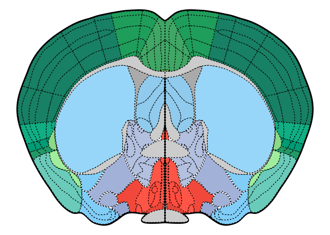
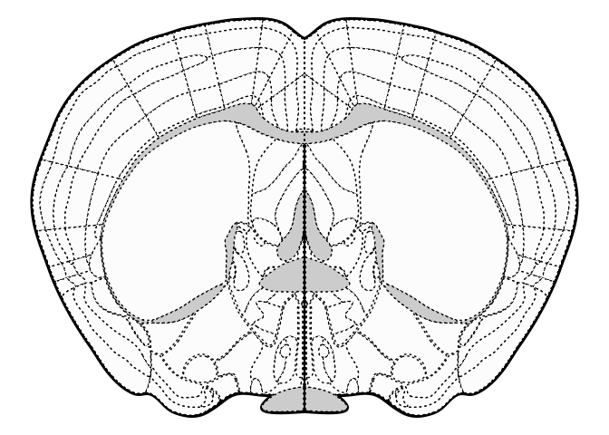
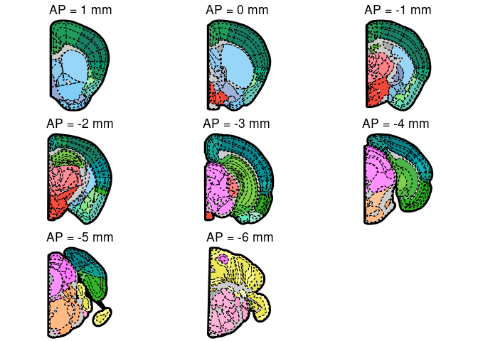
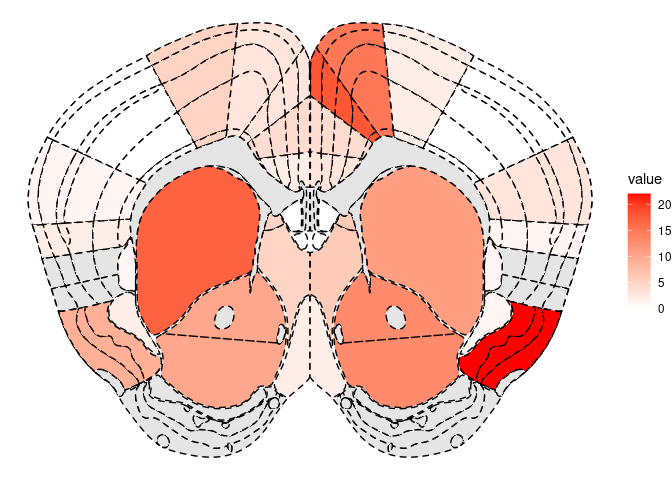

<!-- README.md is generated from README.Rmd. Please edit that file -->

# nobrainr

<!-- badges: start -->
<!-- badges: end -->

The goal of nobrainr is to provide a simple interface to plot plates
from the [Mouse Allen Brain
Atlas](https://mouse.brain-map.org/experiment/thumbnails/100048576?image_type=atlas).

## Installation

You can install the development version from
[GitHub](https://github.com/) with:

``` r
# install.packages("devtools")
devtools::install_github("matiasandina/nobrainr")
```

## Examples

### Plot atlas plate based on AP

``` r
library(nobrainr)
## basic example code
plot_atlas(AP = 0,half = F)
#> Loading required package: grImport
#> Loading required package: grid
#> Loading required package: XML
#> ℹ Coloring by parent ROI
```



You can also use the `bw` argument to get the `bw` version.

``` r
plot_atlas(AP = 0,half = F, bw = T)
#> ℹ BW coloring
```



### Plot multiple atlas plates

A little bit of knowledge in R can help manipulate the resulting
`ggplot2` object. We can use `verbose = FALSE` to avoid all the user
feedback.

``` r
# AP values need not be exact, they are rounded to correct plates
desired_AP <- seq(1, -6, -1)
plot_list <- 
purrr::map(
  desired_AP,
  ~plot_atlas(AP=.x, half=T, verbose=F) + 
    ggplot2::labs(title = glue::glue("AP = {.x} mm"))
)
cowplot::plot_grid(plotlist = plot_list)
```



### Export

If you want to export the plots to an `svg` format for presentation you
can use the `ggsave` function from the `ggplot2` package.

``` r
p1 <- plot_atlas(0)
ggplot2::ggsave(filename = "plot_title.svg", 
                plot = p1) # <- will save to the local directory, check ?ggsave
```

### Plot counts calculated elsewhere

This package comes with data that contains cell counts in different
brain regions.

``` r
trial_df
#> # A tibble: 568 x 4
#>    parent side  value mm_from_bregma
#>    <chr>  <chr> <dbl>          <dbl>
#>  1 MOp    left      6           2.72
#>  2 MOs    left      6           2.72
#>  3 PL     left     17           2.72
#>  4 MOp    right     0           2.72
#>  5 MOs    right    14           2.72
#>  6 PL     right    18           2.72
#>  7 ACAd   left     24           2.01
#>  8 DP     left      3           2.01
#>  9 EP     left      3           2.01
#> 10 MOp    left      6           2.01
#> # … with 558 more rows
```

You can plot the counts using `plot_roi_counts()`.

``` r
plot_roi_counts(trial_df, AP=1.1, half=FALSE)
#> ℹ Coloring by `value` in `count_df`
```



Mind that not all AP levels are present on this sample data. Within each
AP, not all ROIs have data either. Because we can’t plot nonexistent
data, `nobrainr` will throw an error.

``` r
plot_roi_counts(count_df = trial_df, AP=1, half=FALSE)
#> Error: No counts found for AP=1 in `count_df`
```

## Contribute

This is a preliminary release. Please file
[issues](https://github.com/matiasandina/nobrainr/issues) to improve the
package.

## Acknowledgements

This package contains data coming from
[wholebrain](https://github.com/tractatus/wholebrain) package.
